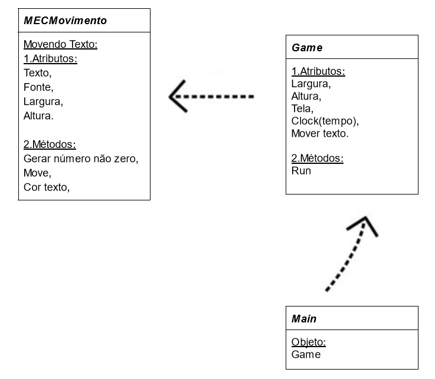

<h1>Descrições da estrutura: </h1>
<h2>
1. Atributos </h2>
<h2>
2. Métodos 
</h2>

<h2>Diagarama UML: </h2>

<h3>Classe MecMovimento:</h3>

1. Atributos:
Fonte = Determinar o tamanho da fonte do textoDefinir o tamanho da fonte
Texto = Definir o texto em tela
Largura = Definir largura da janela
Altura Definir altura da janela       

2. Métodos:
Gerar numero não zero = Sorteio entre os número -1 e 1
Move =  o texto na direção X e Y
Cor texto = Sortear a cor do texto

<h3>Classe Game: </h3>

1. Atributos
Largura: Estabelece o tamanho da largura da janela
Altura: Estabelece o tamanho da altura da janela
Tela : Configura o modo de exibição grafica da janela do jogo.
Clock : Define o tempo de execução
Movendo Texto: Define os atrbitos da classe MECMovimento que serão renderizados

2. Métodos:
RUN: Executa o jogo e seta comandos

<h3>Classe Main: </h3>

Inicia o objeto GAME

